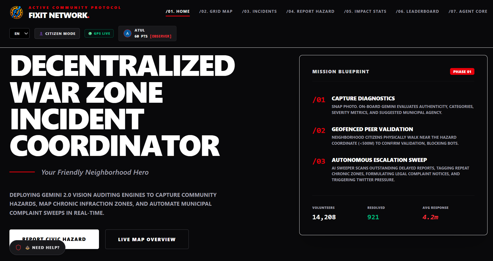
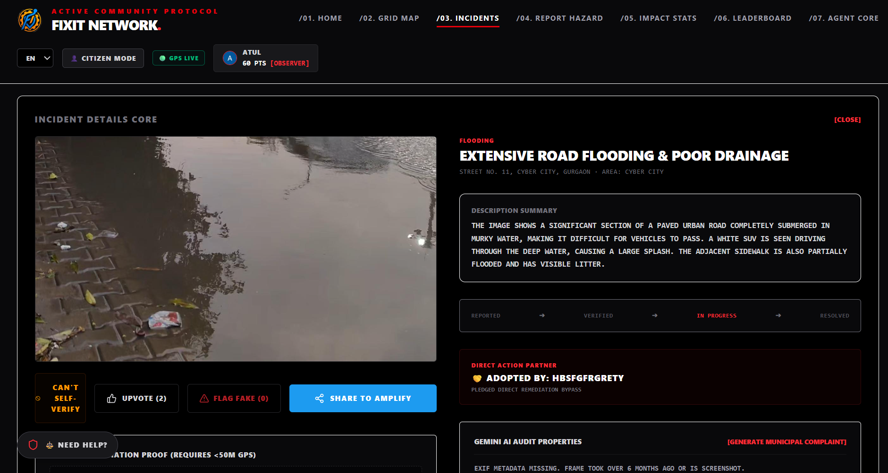
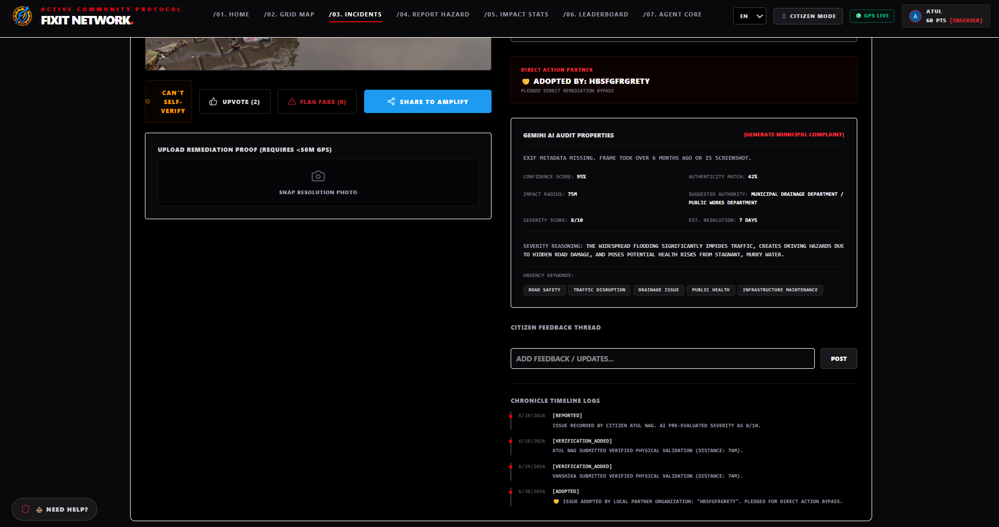
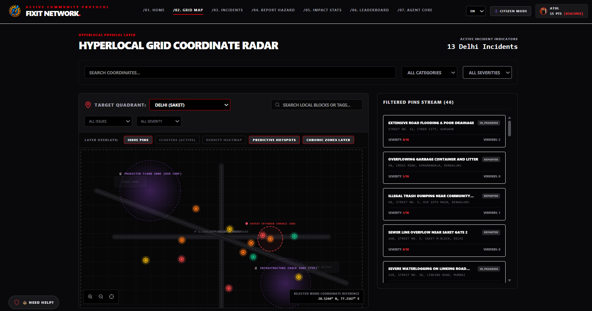
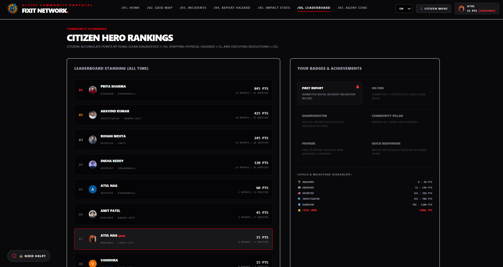
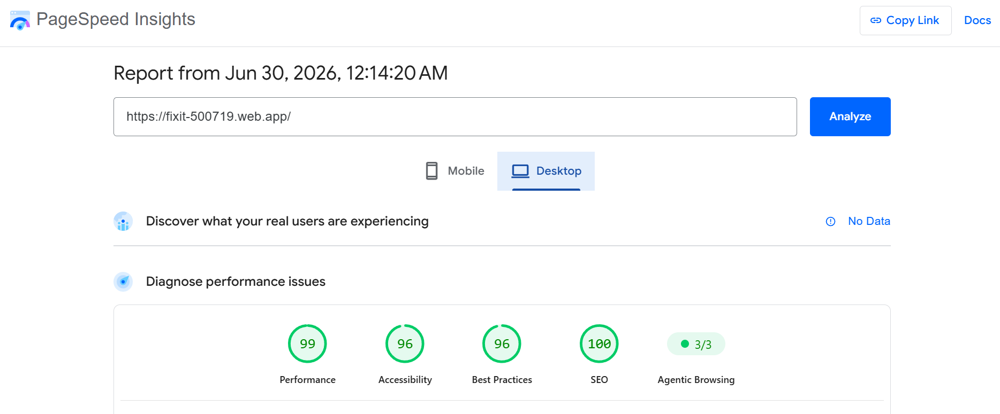
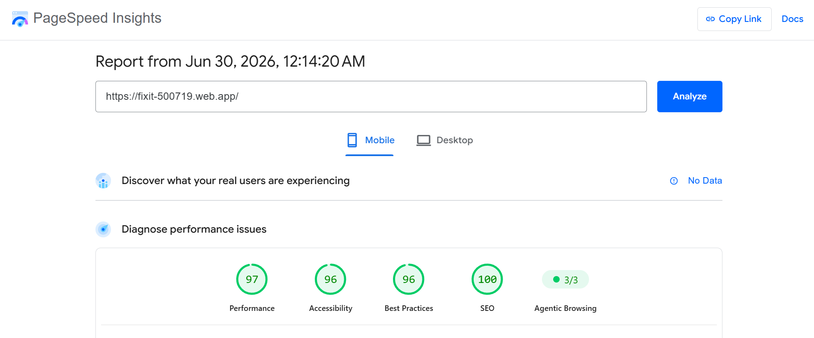

# FixIt: Your Friendly Neighborhood Hero
### Hyperlocal Civic Issue Reporting, Community Action & AI Resolution Platform
**Vibe2Ship Hackathon | Problem Statement 2: Community Hero**

> [!IMPORTANT]
> **Demo / Hackathon Evaluation Note:** 
> Since the backend API server is hosted on Render's free tier, the backend service automatically spins d own (goes to sleep) after 15 minutes of inactivity. On the first server call (such as loading issues, submitting a report, or clicking **Sign In with Google**), the server may take **10 to 15 seconds to wake up (cold-start)**.
> 
> > * **Google Sign-In Experience**: To prevent browser redirection to Render's raw "Service is spinning up" build log page, the frontend will intercept the click, display a loading toast ("Waking servers..."), and ping the backend. As soon as the server is fully awake, you will be redirected to the Google Auth page instantly.


> [!NOTE]
> **CI/CD Pipeline Note (GitHub Actions shows red X but deployment succeeds):**
> The GitHub Actions workflow will report a failed status on every push to main. This is a **confirmed regression in firebase-tools** where the CLI makes a redundant release API call after a successful deploy, causing a false FAILED_PRECONDITION 400 error. The deployment **does succeed** — every push to main is live at [https://fixit-500719.web.app](https://fixit-500719.web.app). We deliberately avoided `continue-on-error: true` as a workaround, as it would silently mask genuine deployment failures in the future.

---

## 🚀 Live Deployments

* **Frontend Web App (Google Cloud Hosted):** [https://fixit-500719.web.app](https://fixit-500719.web.app)
* **Backend API Service:** [https://fixit-api.onrender.com](https://fixit-api.onrender.com)

### 🏗️ Split-Domain Deployment Architecture
To secure a Google Cloud hosted domain while avoiding cloud-billing card authentication issues (due to international payment blocks on standard bank accounts), FixIt is deployed in a hybrid state:
* **Frontend Web App:** Hosted on **Firebase Hosting** (Google Cloud CDN), providing a fast, secure, and HTTPS-encrypted `*.web.app` endpoint.
* **Backend API Server:** Hosted on **Render.com** (Native Node.js runtime) connecting to a remote MongoDB Atlas database.
* **Cross-Origin Auth:** Uses standard `Authorization: Bearer <token>` headers to bypass cross-domain third-party cookie restrictions enforced by modern browsers.

---

## 📖 Product Overview

**FixIt** (tagline: *"Your Friendly Neighborhood Hero"*) is a next-generation civic empowerment platform that turns citizens into the city's nervous system. Traditional municipal portals often fail due to a lack of transparency, no community-driven verification, vulnerability to fraudulent/fake reports, and passive communication structures.

FixIt bridges this gap by combining:
1. **Interactive Live Map Canvas:** Responsive coordinates plotting featuring severity-based pulse animations.
2. **AI-Powered Image Diagnostics:** Google Gemini 2.5 Flash vision scanner automatically extracts categories, severity scores, impact radius, and authenticity reasoning.
3. **Hyperlocal Neighborhood Engagement:** GPS-based geofenced peer verification (<500m proximity) and organization adoption.
4. **Autonomous Backend Sweeper:** The backend engine automatically flags duplicate proximity reports, tags chronic incident zones, and auto-escalates neglected public hazards.
5. **Twitter/X Social Pressure Pipeline:** Pre-formats tweets targeting city-specific municipal handles (like `@BBMPCOMM` or `@mybmc`) to bypass traditional administrative blackholes.
6. **Gamification & Trust Metrics:** Citizen points, helper level-ups, badge credentials, and a live, security-sanitized neighborhood leaderboard.

### 📢 The Twitter/X Amplification Rationale
A common pitfall of new civic apps is the **limited initial audience**—if reports only live inside the app, they are easily ignored by government departments. 
FixIt bypasses this hurdle by transforming verified local issues into public social media campaigns. When an issue receives **5+ physical citizen verifications**, the app unlocks a Twitter/X preview targeting the specific city municipal commissioner (e.g. `@BBMPCOMM` in Bengaluru or `@mybmc` in Mumbai) with exact coordinates, photos, and links, pushing accountability to the public square.

---

## 🏆 Why Existing Platforms Fail (And How FixIt Solves It)

* **Official Grievance Portals (MyGov, local municipal apps):**
  * *Why they fail:* Black hole of data. No progress updates, zero public accountability, no civic community support, and clunky, slow user experiences.
  * *FixIt Solution:* Public status pipeline timelines, autonomous AI agents escalating neglected cases, and an automated municipal complaint letter generator to give teeth to reports.
* **Traditional Citizen Mapping Apps (SeeClickFix, FixMyStreet):**
  * *Why they fail:* No automated validation leads to spam, lacks social media amplification mechanisms, and has no personal reward/gamification engine to sustain long-term engagement.
  * *FixIt Solution:* AI-powered metadata analysis, geofenced GPS verification, Twitter auto-amplification, and rich local gamification metrics.

---

## 🎬 Application Page Highlights & Screenshot Placeholders

*Below are the core interfaces that showcase the complete civic reporting and resolution pipeline:*

### 1. The Interactive Dashboard & Live Feed
*Displays the split hero visual, real-time statistics, and the hyperlocal live feeds calculated relative to the citizen's GPS coordinates.*
<!-- [SCREENSHOT: Landing Page & Live Activity Feed] -->


### 2. Multi-Step AI Reporting Wizard
*Allows users to upload photos, trigger Gemini-powered analysis, view diagnostic metadata, and submit reports bound directly to device coordinates.*
<!-- [SCREENSHOT: AI Image Scanner & Report Form] -->
| AI Reporting Wizard | AI Reporting Step 2 |
| --- | --- |
|  |  |

### 3. Interactive Map Explorer
*A detailed view of the community with color-coded incident pins pulsing in real time. Hotspots and chronic zone bounds are highlighted.*
<!-- [SCREENSHOT: Map Explorer page] -->


### 4. Admin Command Panel & Agent Sweeps
*The command center where administrators can inspect active logs, trigger automated sweeps, and reset the demo database.*
<!-- [SCREENSHOT: Admin Panel with sweep logs] -->


### 5. Gamified Citizen Leaderboard
*Displays the top-performing civic helpers in the community, sanitizing all sensitive details like email addresses before listing profiles.*
<!-- [SCREENSHOT: Leaderboard ranks] -->


---

## 📈 Google PageSpeed Insights Validation

FixIt was optimized and validated through **Google PageSpeed Insights** to ensure the civic reporting experience remains fast, accessible, discoverable, and agent-friendly across desktop and mobile conditions. The production build was tuned with Firebase Hosting cache/security headers, route-level JavaScript splitting, reduced render-blocking resources, system font stacks instead of remote font downloads, smaller responsive image URLs, valid crawler files (`robots.txt`, `sitemap.xml`), and an `llms.txt` file for agentic browsing.

Latest PageSpeed snapshot from **June 30, 2026, 12:14 AM**:

| Experience | Performance | Accessibility | Best Practices | SEO | Agentic Browsing |
| :--- | :---: | :---: | :---: | :---: | :---: |
| **Desktop** | **99** | **96** | **96** | **100** | **3/3** |
| **Mobile** | **97** | **96** | **96** | **100** | **3/3** |

<!-- [SCREENSHOT: Google PageSpeed Insights Desktop Scores] -->
| Desktop PageSpeed | Mobile PageSpeed |
| --- | --- |
|  |  |

<!-- [SCREENSHOT: Google PageSpeed Insights Mobile Scores] -->
 
---

## 💡 Google Technologies Utilized

FixIt leverages a multi-dimensional Google stack across its development lifecycle and runtime operations:

1. **Google Gemini 2.5 Flash (via AI Studio SDK):**
   * **Visual Scanner:** Analyzes base64 civic photos to identify category type, severity score (1-10), impact radius (in meters), and authenticity metrics.
   * **Complaint Generator:** Automatically compiles professional, legal-formatted plain-text complaint letters addressed to local municipal officials.
2. **Google Gemini Nano:** Used to generate the high-fidelity branding logo (`assets/logo.png`) representing the platform across the favicon, headers, and Twitter cards.
3. **Google AI Studio:** Used as the environment to test, refine, and structure the vision prompts and schema structures before porting to code.
4. **Antigravity IDE (Google DeepMind):** Used as the agentic programming companion to structure the server into a clean MVC architecture, implement Zod validation guards, and verify the backend sweeper logic.
5. **Firebase Hosting:** Used for static web app delivery, serving the pre-compiled frontend assets securely from Google Cloud edges.
6. **Google PageSpeed Insights:** Used to validate production performance, accessibility, best practices, SEO, and agentic browsing quality across desktop and mobile audits.

---

## 🛠️ Technologies Utilized

### Frontend
| Technology | Usage |
| :--- | :--- |
| **React 19 + Vite** | Core UI framework and fast build tooling. |
| **React Router v6** | Client-side routing and navigation. |
| **Tailwind CSS v4** | Modern component styling and visual customization. |
| **Zustand** | Light, high-performance state management for issues, filters, and sessions. |
| **Motion** | Fluid animation library powering the radar and pulse effects. |
| **react-i18next** | Internationalization module for English, Hindi, and Kannada toggles. |
| **Recharts** | Interactive dashboard visualizations and trend lines. |
| **Lucide React** | Scalable UI vector icon set. |
| **Sonner** | Clean Toast notifications for asynchronous events. |

### Backend
| Technology | Usage |
| :--- | :--- |
| **Node.js + Express** | High-concurrency REST API server. |
| **MongoDB Atlas** | Cloud database storing issues, users, sessions, and agent sweep logs. |
| **Mongoose** | Schema-driven Object Data Modeling (ODM). |
| **Zod** | Strict request body validation guards. |
| **Docker & Compose** | Containerized builds mirroring production environments locally. |
| **express-rate-limit** | Built-in security and spam prevention middleware. |

---

## 🔐 Session-Based Token Authentication

FixIt uses **industry-standard opaque session tokens** transmitted via the `Authorization: Bearer <token>` header — the same secure approach used by Google APIs, GitHub, and Stripe.

| Attribute | Detail |
| :--- | :--- |
| **Header Name** | `Authorization` |
| **Token Type** | `Bearer <session_id>` (crypto-generated 256-bit random UUID) |
| **Client Storage** | Securely in `localStorage` and cleaned from URL query strings on launch |
| **Server Storage** | MongoDB `sessions` collection with TTL index (7-day auto-expiry) |
| **Logout** | Deletes session record from DB → token invalidated instantly on server |

### Why This Beats JWT

| Feature | JWT (Stateless Token) | Session ID (FixIt Approach) |
| :--- | :--- | :--- |
| **Instant Logout** | ❌ No (stays valid until expiration) | ✅ Yes (wiped immediately from database) |
| **Payload Security** | ⚠️ Decodable (Base64 is public) | ✅ Opaque (UUID carries no metadata) |
| **Instant User Ban** | ❌ Requires complex blacklist | ✅ Immediate (delete session record) |
| **Industry Use** | Auth0, Firebase | **Google, GitHub, Stripe** |

---

## 🔒 Security, Privacy & Integrity Guardrails

To protect user identities and prevent exploitation of gamified systems, FixIt includes six core backend protections:

1. **Leaderboard Profile Sanitization**:
   * **Risk**: Exposing private database keys, password hashes, or email addresses through public rank lists.
   * **Protection**: The `/api/users` endpoint uses a whitelisting projection query (`PUBLIC_USER_FIELDS`), completely stripping out the user's `email`, internal `_id`, and `__v` fields. Only public display stats, level, and badges are visible.

2. **Anonymous Report Isolation**:
   * **Risk**: Cross-referencing anonymous reports with database user tables through front-end network calls to identify whistleblowers.
   * **Protection**:
     * On creation, anonymous reports write public placeholder strings (`'Anonymous'` for reporter name, `null` for avatar).
     * The real reporter's UID is kept privately in the database for backend checks.
     * On retrieval, `GET /api/issues` sanitizes issues server-side, stripping the `reportedBy` UID entirely on anonymous items before the payload leaves the server.

3. **Self-Verification Block on Anonymous Submissions**:
   * **Risk**: Users bypass self-verification rules by marking their own issues anonymous, then validating them to gain points.
   * **Protection**: Proximity verification checks the real authenticated user session against the hidden private `reportedBy` field directly on the server database, blocking self-verification regardless of the public anonymous flag.

4. **Minimized Storage Footprint**:
   * **Risk**: Local storage caching vulnerable to XSS inspection.
   * **Protection**: Purged all active cache files for user accounts, leaderboard profiles, and session states from `localStorage`. A boot migration script auto-wipes legacy cache strings on page refresh.

5. **Multi-Dimensional Spam & Rate Limiting**:
   * **Risk**: Automated spam bots creating thousands of fake reports, or users spamming requests to drain the Google Gemini API key quota.
   * **Protection**: 
     * **General API Limiting**: A custom MongoDB-backed sliding limiter limits all endpoints to `100 requests per 15 minutes` per User ID or IP address.
     * **Incident Submission Quota**: A specific `incidentUploadSpamLimiter` limits incident reports (`POST /api/issues`) to a maximum of `5 reports per week`. The check queries past issues for BOTH the authenticated `reportedBy` user UID AND the `reporterIp` address, preventing attempts to bypass limits by creating duplicate accounts on the same connection.

6. **Role-Based Access Control (RBAC) & Presentation Mode Gating**:
   * **Risk**: Unauthorized users gaining access to administrative control tools (running sweeps, clearing data).
   * **Protection**: 
     * Added a `role` field (`'citizen' | 'admin'`) to the database User schema.
     * The `/admin` panel route checks `currentUser.role`. Non-admins are blocked with a detailed security-themed **403 Access Forbidden** screen.
     * Secure endpoints (like executing sweeps and resets) enforce backend verification.
     * To facilitate smooth hackathon demos, a **"Simulate Admin Role"** switch is integrated into the header. Toggling it updates the live database user record, enabling presenters to showcase both restricted citizen states and administrator powers.

---

## 🌍 Real GPS Location & Automatic Quadrant Targeting

FixIt uses the browser **Geolocation API** for true geofenced proximity verification.

- **Pre-Prompt Modal**: Explains *why* GPS is required (verifies that confirming citizens are within the 500m geofenced radius) before requesting permissions.
- **Reporting Gate Lock**: The hazard reporting page is **strictly locked** if location is not authorized yet, presenting a clean button to trigger the browser GPS permission prompt directly from the page.
- **Automatic Target Quadrant Selection**: Sourced a proximity lookup function inside `MapCanvas.tsx`. On mount/load, the map automatically calculates which city center (Bengaluru / Mumbai / Delhi / Gurgaon / Noida) is closest to the user's active coordinates and **automatically selects and centers on that city's map quadrant**.
- **Locked GPS Targeting**: The reporting wizard automatically and **exclusively** binds the incident report coordinates to the user's real-time device coordinates (`userLat`, `userLng`). All manual lat/lng coordinate overrides or map pickers have been deprecated to prevent coordinates manipulation.
- **Live Navbar Status**: Displays `🟢 GPS Live` / `🔴 GPS Off` in the header reflecting permissions.

---

## 🌐 Internationalization (i18n)

To support diverse local communities, FixIt implements complete multi-lingual support via `react-i18next`:
* **Supported Languages:** English (`en`), Hindi (`hi`), and Kannada (`kn`).
* **Implementation:** The navbar contains a localized toggle button. Localized content is mapped across locale files (e.g. `src/i18n/locales/en.json`, `src/i18n/locales/hi.json`, and `src/i18n/locales/kn.json`) covering the reporting form, navigation panels, descriptive tooltips, and map markers.

---

## 🤖 Autonomous Backend Sweeper Engine

`POST /api/agent/sweep` performs backend-level sweeps on reported issues to automate dispatching and validation:

1. **Auto-Escalation:** Scans all active issues. If an issue has a severity score $\ge 7$ (High/Critical) and remains unresolved for more than 48 hours, the agent automatically upgrades the status to `escalated` and generates a legal notification for the municipal ward commissioner.
2. **Duplicate Merging:** Checks for issues of the same category reported within a **100-meter radius**. The agent marks the duplicate as `rejected`, merges the comments and image files, and combines the unique user upvotes into the parent issue.
3. **Chronic Zone Sweep:** Scans for repeat issues of the same category reported within a **200-meter radius** in the last 90 days. If 3 or more issues are detected, the agent auto-tags the coordinate bounds as `🔴 Chronic Zone` and upgrades the severity to critical.

---

## 🛡️ Known Challenges & Future Roadmap

* **Anonymity & Personal Safety:**
  * *V1 Approach:* Anonymous database flags and server-side UID stripping on delivery.
  * *V2 Roadmap:* Integration of **Zero-Knowledge-Proofs (ZKP)** like Semaphore to let users verify their resident status and report hazards without revealing their ID.
* **Fake Reports & AI-Generated Media:**
  * *V1 Approach:* Image analysis via Gemini vision metadata checks, public flag options, and automated authenticity scoring.
  * *V2 Roadmap:* Integration of **C2PA / Google SynthID metadata checks** to verify if photos were created with generative AI.
* **Resolution Fraud:**
  * *V1 Approach:* Proximity-locked resolution photo (<50m tolerance) with mandatory citizen verification.
  * *V2 Roadmap:* Machine-learning computer vision models comparing "before" and "after" photos side-by-side to guarantee visual resolution.
* **No Official Municipal APIs:**
  * *V1 Approach:* Pre-drafted plain-text letters formulated via Gemini and X/Twitter social pressure pipelines.
  * *V2 Roadmap:* Direct integrations with national public grievance portals (like CPGRAMS) and WhatsApp Business municipal chatbots.

---

## 🛠️ Step-by-Step Feature Test Guide (Live Deployment)

Use these steps to test the live application directly:

### Step 1: Open the Application
Navigate to the hosted URL: **[https://fixit-500719.web.app](https://fixit-500719.web.app)**.

### Step 2: Test GPS Onboarding & City Targeting
1. On first load, review the GPS permission explanation modal.
2. Either allow live GPS access or select a fallback city.
3. Open the **Map** tab and change the **Target Quadrant** selector between Bengaluru, Mumbai, Delhi, Gurgaon, and Noida.
4. Confirm that the active incident counter updates for the selected city and the map recenters to that local grid.

### Step 3: Test AI Image Diagnostics & Reporting
1. Navigate to the **Report** tab in the navigation bar.
2. Grant browser location permissions when prompted.
3. Upload an image representing a civic hazard (e.g., a pothole or damaged streetlight).
4. Click **Analyze Image**. Google Gemini 2.5 Flash will automatically detect the issue title, category, severity, and suggested municipal authority.
5. Complete the rest of the form (choose to submit anonymously or publicly) and click **Report Hazard**.

### Step 4: Test Issue Inspection, AI Audit & Municipal Complaint Generation
1. Open an incident from the **Dashboard** live feed, **Incidents** stream, or **Map** pin.
2. Review the **Gemini AI Audit Properties** card showing authenticity reasoning, confidence, impact radius, suggested authority, and estimated resolution time.
3. Click **[Generate Municipal Complaint]**.
4. Click **Assemble Letter via Gemini AI**. FixIt will generate a formal municipal complaint using the issue title, location, severity, verification count, unresolved duration, current generation date, and known reporter name (or protected anonymous citizen label).
5. Use **Copy Letter Text** or **Download .txt File** to export the complaint for email, print, or civic escalation.

### Step 5: Test Geofenced Proximity Verification
1. Navigate to the **Map** tab and click on an active issue pin, or select an issue from the live feed on the **Dashboard**.
2. If your browser location is within 500 meters of the issue coordinate, the **Verify Proximity** button will unlock. 
3. Click it to cast a physical verification. This awards you **5 points** and increments the issue's community verification index.
4. Try to verify your own submitted issue — the server will flag the session ID match and block the operation.

### Step 6: Test Social Amplification & Citizen Action
1. Open a verified or self-reported incident.
2. Click **Share To Amplify** to preview a city-specific X/Twitter escalation message with the municipal handle, issue title, severity, coordinates, and campaign tags.
3. Try the **Adopt This Incident** widget by entering a Resident Welfare Association, NGO, or local business name and clicking **Adopt**.
4. Use the feedback thread to add a citizen update or observation.

### Step 7: Test Resolution Proof Flow
1. Open an unresolved issue.
2. If your simulated/current GPS position is within 50 meters of the issue, the remediation proof upload unlocks.
3. Upload a resolution photo and click **Certify Resolution Proof**.
4. For resolved issues, review the before/after comparison slider.

### Step 8: Test Leaderboard, Profile & Legal Aid
1. Open **Leaderboard** to review public, sanitized citizen ranking data without private emails or database IDs.
2. Open **Profile** to review current user points, badges, contribution stats, and Google sign-in entry point.
3. Click **Need Help?** in the bottom-left floating legal aid widget to view safety resources, helpline actions, and anonymous threat-reporting support.

### Step 9: Admin Mode & Sweeper Execution
1. In the header bar, click the simulation button: **[CITIZEN MODE]**. It will switch your active DB record to **[ADMIN MODE]**.
2. Navigate to the newly unlocked **Admin** tab.
3. Observe the three core sweeper rules available to run:
   * **Duplicate Merges:** Detects same-category issues reported within 100 meters, merging comments/upvotes and rejecting the child report.
   * **Chronic Zone Escalations:** Flags repeat incident zones (3+ within 200m) as chronic and upgrades severity to critical.
   * **Auto-Escalation:** Escalates unresolved high-severity reports outstanding for >48 hours.
4. Click **Run Sweeper**. Review the audit trail log printed at the bottom of the page showing the changes made to the database.

### Step 10: Test the Session-Safe Reset
1. While still on the **Admin** panel, click **Reset Demo Database**.
2. This triggers a server-side wipe and re-seed of all collections (57 default issues across 5 major Indian cities) but preserves your current session token. 
3. Observe that you remain fully authenticated and your admin role state is maintained.

---

## 💻 Local Setup Guide (Alternative)

If you wish to configure and run the environment on your local machine:

### Option 1: Standard Node.js Setup
1. Clone the repository and configure your environment variables in `.env` (refer to `.env.example`).
2. Install dependencies:
   ```bash
   npm install
   ```
3. Run the development server (runs Express + Vite concurrently on port 3000):
   ```bash
   npm run dev
   ```
4. Access the application in your browser at `http://localhost:3000`.

### Option 2: Docker & Docker Compose Setup
To run the application in a local containerized environment (mimicking the production container):
1. Ensure Docker Desktop is installed and running.
2. Configure your environment variables in the `.env` file at the root.
3. Build and launch the container:
   ```bash
   docker compose up --build
   ```
4. Open your browser and access the app at `http://localhost:3000`.
*(Note: Docker Compose automatically loads keys from the local `.env` and uses the multi-stage [Dockerfile](file:///c:/Users/atulk/Desktop/fixit/Dockerfile) to build and run a production bundle).*
